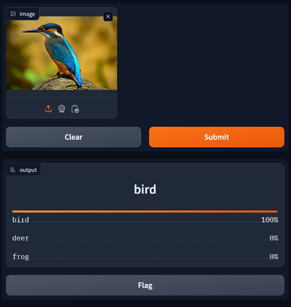

This project was part of a 9-week training course I attended in 2024.
- **Bootcamp**: Ironhack [AI Engineering bootcamp](https://www.ironhack.com/de-en/artificial-intelligence/remote)
- **Date**: September to November 2024
- **Teammates**: [KK](https://github.com/karthik-kk-aiml), [Freddy](https://github.com/fredsmeds)
- **Project topics**: Deep Learning, CNNs, Transfer Learning, Fine-Tuning, VGG16, ResNet50

Final Grade and teacher's feedback:
```
- Presentation. Good summary slide comparing all approaches
- Code: You shared all the intermediate notebooks - I didn't check all of them, but this is a good practice.
- Report: Choice of the dataset is very well justified
- Report: Typically you don't say "batch normalization" for input data normalization, only for the BN layers
- The report was clear and easy to follow and understand, with charts that show model architecture and performance
- You tried transfer learning with two prebuilt models and compared them, that is very good
- Good decision making that shows clear understanding of the underlying concepts
- I appreciated the README. It is a good practice so people checking your work can easily understand where to go. It still was not clear to me which of the notebooks is the one referred in the report section 3.2
- Presentation: overall good. Too extensive 27 slides for a 12 minute presentation.
- Summary: Excellent work and results, congratulations!
- Final grade: 9.66 / 10
```

----

# Project I | Deep Learning: Image Classification with CNN

Build a Convolutional Neural Network (CNN) model to classify images from a given dataset into predefined categories/classes.



[Task Descriptions and Project Instructions](https://github.com/ironhack-labs/project-1-deep-learning-image-classification-with-cnn)

## Repository Folders and Files

Here is a short description of the folder and files available on the repository.

### Documents
**Group2 - Image Classification with CNN - Final Report**  
Final PDF report (shared with group)  

**Group2 - Image Classification with CNN - Presentation Slides**  
Final Slides presentation (shared with group)  

### Notebooks  
- **animals10_dataset_exploration**: Explores the Animals10 dataset (not used)
- **cifar10_dataset_exploration**: Explores the Cifar10 dataset (used in project)
  
- **model1_training**: Training a minimalist CNN from scratch
- **model2_training**: Improving model 1 with a more complex structure
- **model3_training**: Improving model 2's hyperparameters and experimenting with optimizers
- **model4_training**: Improving model 3 and reducing overfitting
- **model5_training**: Trying to replicate VGG16 architecture and train it from scratch
- **model6_training**: Transfer learning on VGG16 - Failed
- **model7_training**: Transfer learning on ResNet50 - Best model
- **model8_training**: Fine-tuning model 7 - Failed
  
- **model_testing**: Load and test the model on unseen pictures
- **model_deployment**: Deploy a demo of our best model on Gradio

### Python Modules
**helpers.py:** Helper module used my all the notebooks with useful methods to load and preprocess the dataset, evaluate the model, plot curves and confusion matrix, and so on.

### Additional Folders
**test_images**: folder of unseen images to test on the model

## Installation
Use **requirements.txt** to install the required packages to run the notebooks. It is advised to use a virtual environment.
```bash
python -m venv .venv
.venv/Scripts/activate
pip install -r requirements.txt
```

## Acknowledgements
A big thank you to my colleagues Freddy and KK who worked with me all along this exciting and challenging project.